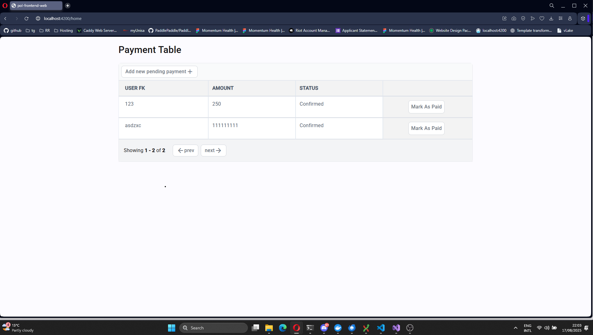

# PaymentOrchestrator Lite — Frontend

A lightweight Angular frontend for the PaymentOrchestrator Lite project.

## Prerequisites

- Node.js & npm installed Or
- Docker

## Quick Start (Local)
1. Install dependencies:
```bash
npm install
```
2. Start the development server:
```bash
npm run dev
```
3. Open your browser at http://localhost:4200

## Quick Start (Docker)

1. Build and run using Docker:

```bash
docker compose up -d
```
2. Open your browser at http://localhost:4200


